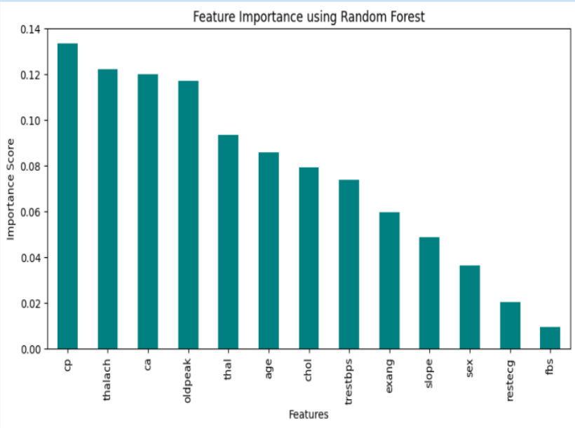

Heart Disease Severity Prediction using Machine Learning

Overview

This project predicts the severity level of heart disease using Machine Learning techniques. Instead of performing binary classification (disease/no disease), the project classifies patients into multiple severity levels based on clinical indicators.

Four machine learning algorithms were implemented and compared:

• Gaussian Naive Bayes
• Support Vector Machine (SVM)
• Multinomial Logistic Regression
• Random Forest

The objective was to identify the most effective model for heart disease severity prediction.

---

Problem Statement

Heart disease remains one of the leading causes of mortality worldwide. Early prediction of disease severity can assist healthcare professionals in identifying high-risk patients and making timely medical decisions.

This project uses patient clinical data to predict the severity level of heart disease using supervised machine learning techniques.

---

Dataset

Heart Disease Dataset

Dataset Source:
https://www.kaggle.com/datasets/johnsmith88/heart-disease-dataset

The dataset contains medical attributes such as:

• Age
• Sex
• Chest Pain Type
• Resting Blood Pressure
• Cholesterol
• Maximum Heart Rate
• ST Depression (Oldpeak)
• Number of Major Vessels
• Thalassemia
• Exercise-Induced Angina

---

Severity Level Generation

A custom severity scoring system was developed using:

• Maximum Heart Rate (thalach)
• ST Depression (oldpeak)
• Chest Pain Type (cp)
• Number of Major Vessels (ca)

Severity Levels:

• 0 → No Severity
• 1 → Mild
• 2 → Moderate
• 3 → Severe
• 4 → Critical

---

Data Preprocessing

• Missing Value Handling
• Outlier Removal using Z-Score
• Feature Scaling using StandardScaler
• Train-Test Split
• Data Visualization

---

Feature Selection

Random Forest Feature Importance was used to identify the most influential features.

Selected Features:

• thalach
• oldpeak
• cp
• ca

These features were used for model training and evaluation.

---

Models Implemented

1. Gaussian Naive Bayes

A probabilistic classifier based on Bayes' theorem.

2. Support Vector Machine (SVM)

Linear SVM classifier with scaled features.

3. Multinomial Logistic Regression

Used for multi-class severity classification.

4. Random Forest

Ensemble learning method using multiple decision trees.

---

Evaluation Metrics

The following metrics were used:

• Accuracy
• Precision
• Recall
• F1-Score
• Confusion Matrix

---

Results

Gaussian Naive Bayes

Accuracy: 52.94%
Precision: 61.02%
Recall: 52.94%
F1-Score: 50.83%

---

Support Vector Machine

Accuracy: 76.47%
Precision: 75.32%
Recall: 76.47%
F1-Score: 75.54%

---

Multinomial Logistic Regression

Accuracy: 72.06%
Precision: 70.96%
Recall: 72.06%
F1-Score: 71.05%

---

Random Forest

Accuracy: 92.16%
Precision: 92.42%
Recall: 92.16%
F1-Score: 91.85%

---

Result Analysis

Random Forest achieved the highest performance among all models.

Key observations:

• Random Forest delivered the best overall accuracy and F1-Score.
• SVM showed competitive performance but lower accuracy.
• Logistic Regression produced moderate results.
• Gaussian Naive Bayes struggled with the complexity of the dataset.

Random Forest was selected as the best-performing model for heart disease severity prediction.

Model Visualizations

Feature Importance

Random Forest Confusion Matrix

---

Technologies Used

• Python
• Pandas
• NumPy
• Matplotlib
• Scikit-Learn

---

Future Improvements

• Hyperparameter Optimization
• XGBoost Implementation
• Deep Learning Models
• Web Deployment using Flask
• Real-Time Prediction Dashboard

---
